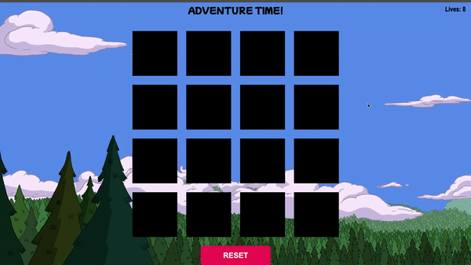

# Adventure Time Memory Game
In this project I explored DOM Manipulation and animation functionality to create a [Memory Flash Card game](https://en.wikipedia.org/wiki/Concentration_(card_game)) using the popular cartoon [Adventure Time](https://en.wikipedia.org/wiki/Adventure_Time) as a theme.

# Technologies used
- HTML
- CSS
- JavaScript

## Livesite link

[Adventure Time Memory Game Live Site](https://pages.git.generalassemb.ly/kinglogan/FlashCards/)

Use the mouse to select two cards. If the cards match, they stay turned over. If the cards do not match, they are flipped back over. The player has 8 attempts to find all of the matches. When all matches have been found the player wins the game.

### Future additions
- Add a timer
- Automatic game reset upon win/loss